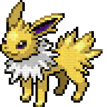

# Jolteon :zap:

A TUI coordination layer above [Claude Code](https://docs.anthropic.com/en/docs/claude-code).
Instead of running multiple Claude instances in the same workspace, Jolteon
creates and helps manage git worktree per task so Claude can work independently and
uninterupted.

> [!IMPORTANT]
> jolteon is still in development, still ironing out issues.

## What Jolteon Can Do

Jolteon is built to help chew through your development backlog. Each task gets
its own worktree and Claude session — you stay in control of every interaction.

1. **Create Tasks**: Add tasks from the TUI or import GitHub issues with
   `jolteon sync`
2. **Start a Session**: Press Enter on a task — Jolteon creates a worktree and
   launches Claude Code in it
3. **Ship It**: Press `p` to push the branch and create a PR, then `x` to clean
   up the worktree

Tasks can come from local YAML or GitHub issues. Jolteon manages the lifecycle:
task -> worktree -> Claude session -> PR -> cleanup.

## Installation

```sh
go install github.com/owenps/jolteon@latest
```

Be sure `~/go/bin` is in your PATH. Then in any project initialize Jolteon.

```sh
jolteon init
jolteon
```

## CLI

| Command           | Description                                     |
| ----------------- | ----------------------------------------------- |
| `jolteon`         | Launch the TUI dashboard                        |
| `jolteon init`    | Initialize Jolteon in the current directory     |
| `jolteon sync`    | Import open GitHub issues into the task backlog |
| `jolteon clean`   | Remove worktrees for completed tasks            |
| `jolteon help`    | Show help                                       |
| `jolteon version` | Show version                                    |

## Keybindings

| Key     | Action                      |
| ------- | --------------------------- |
| `j/k`   | Navigate tasks              |
| `enter` | Start/resume Claude session |
| `n`     | New task                    |
| `e`     | Edit task                   |
| `d`     | Delete task (press twice)   |
| `p`     | Push branch and create PR   |
| `x`     | Clean worktree              |
| `S`     | Sync GitHub issues          |
| `tab`   | Filter by status            |
| `q`     | Quit                        |

## Data



- User config lives at `~/.config/jolteon/`
- Project-level data (tasks) lives at `.jolteon/` in your project directory
- Worktrees are created in `.worktrees/` (gitignored)

## Acknowledgements

- Assets curtosy of [https://sprites.pmdcollab.org/]
